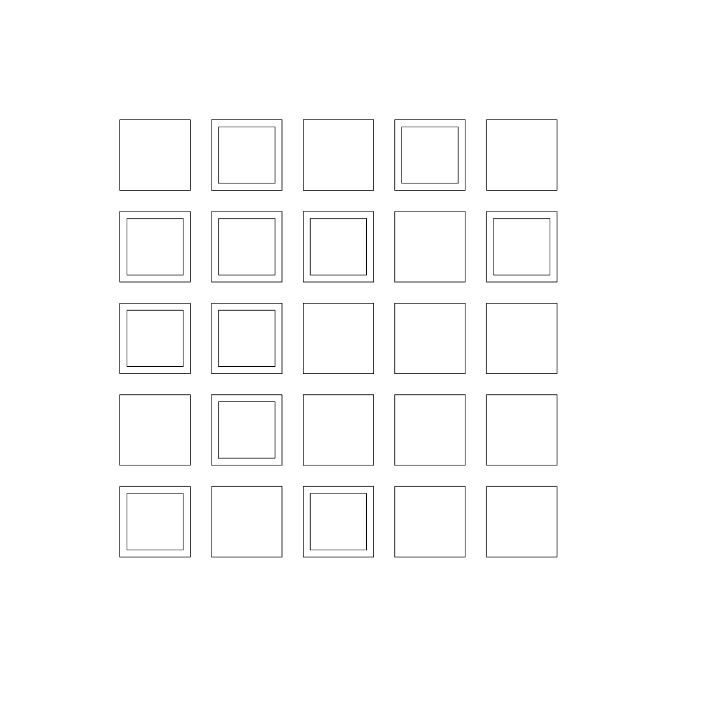
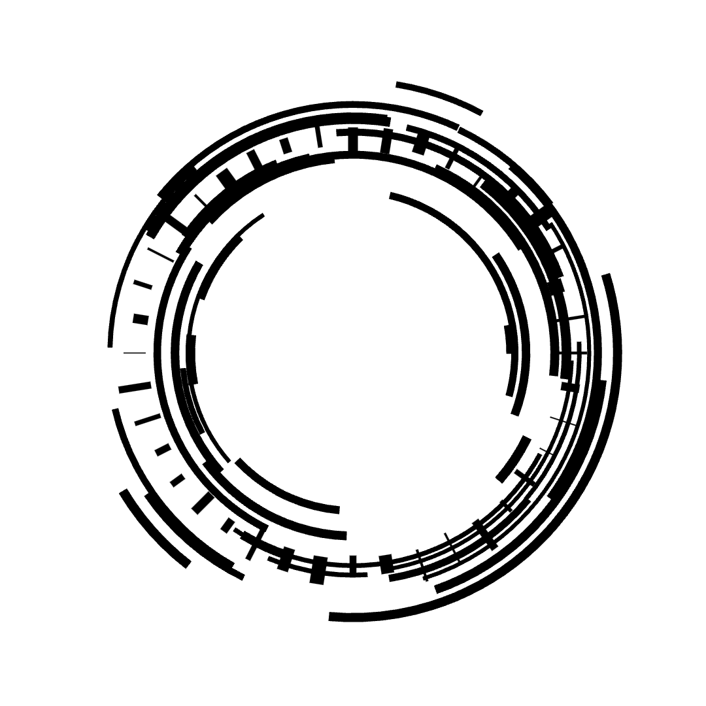

# canvas-sketch
Canvas-sketch is a javascript framework for creating artwork through the browser. You can draw, animate, and interact with the drawing to make intersting canvs.

The most useful thing that you can get out of this framework is learning how pixels work on the browser of your screen. You can draw ploygons by defining grids on your sreen using for loops, calculate distance between two points to make interesting interactions or animations, and much more. 

Below are some demos using [canvas-sketch](https://github.com/mattdesl/canvas-sketch)

## Using Grid

## Drawing Circles and Using canvas-sketch-util (random)

## Particles and Animation

## Perlin Noise and Animation

